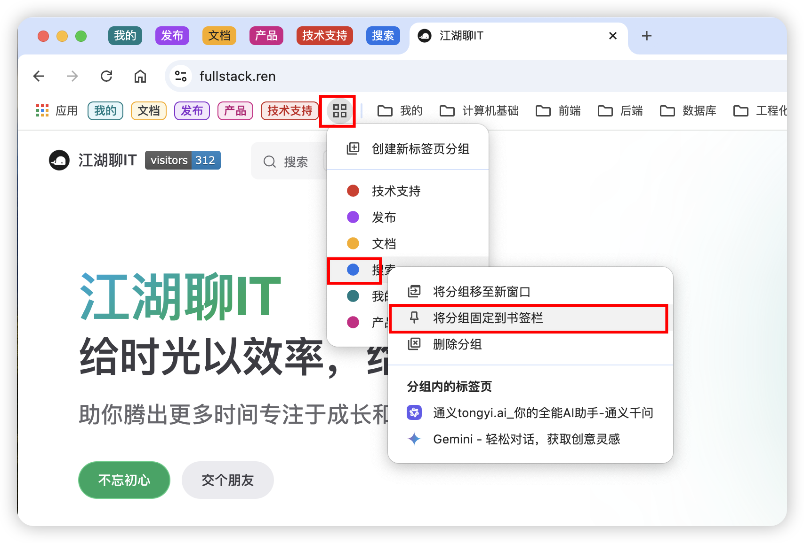
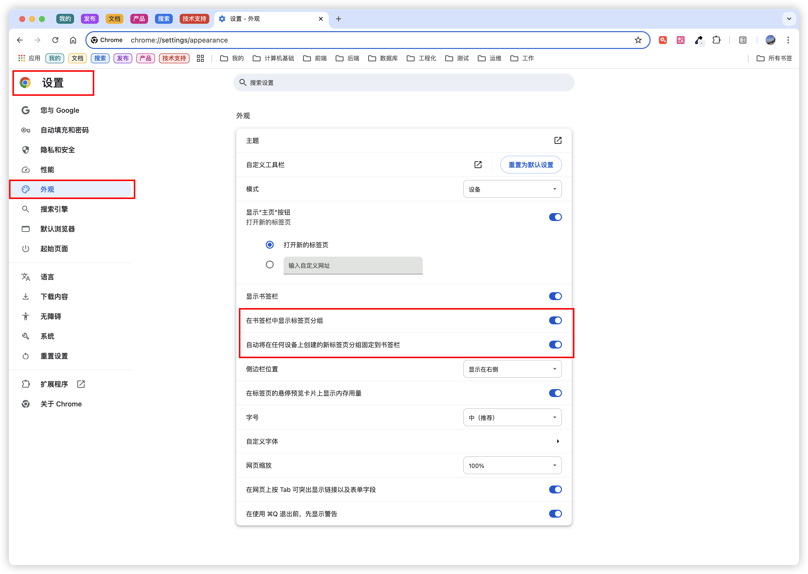

# 标签页分组

当我们在开发时，经常需要打开多个标签页，为了方便管理，可以给标签页分组，方便切换和查看（具体效果图如下，谁用谁知道，早用早受惠）。

## 操作步骤

- 点击：右键点击某个标签页。
- 选择分组：
  - 选择【向群组中添加标签页】。
  - 接着点按【新建组】或【选择现有分组】。
    - 如果选择【新建组】，可给分组定义分组名和分组标签颜色。
    - 
- 管理分组：
  - 书签栏
    - 书签栏【具体分组】右键可支持：分组移至新窗口、取消固定分组、删除分组、打开分组中具体标签页。
    - 
    - 书签栏【分组右侧扩展项】点击可支持：创建新标签页分组、操作具体分组（分组移至新窗口、固定分组、取消固定分组、删除分组）。
    - 
  - 书签
    - 右键支持：修改分组名称、修改分组颜色、添加标签页、分组移至新窗口、取消分组、关闭分组、删除分组。
    - 

## 开关设置

- 分组展示开关
  - 浏览器右上角点击【...】，然后选中【设置】。
  - 左侧菜单选中【外观】。
  - 打开【在书签栏中显示标签页分组】开关。
  - 【标签页分组】就**展示**在书签栏左侧了。
- 分组自动固定开关
  - 浏览器右上角点击【...】，然后选中【设置】。
  - 左侧菜单选中【外观】。
  - 打开【自动将在任何设备上创建的新标签页分组固定到书签栏】开关。
  - 每次分组都**固定**在书签栏左侧了。
- 